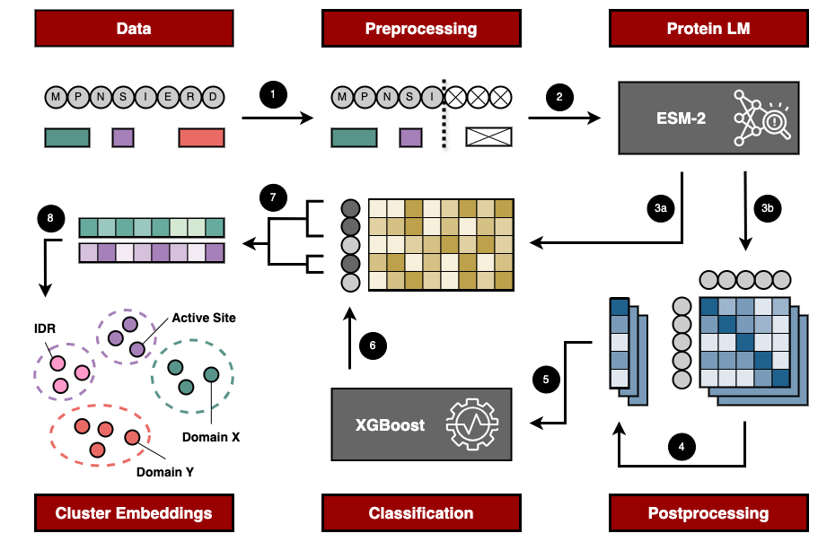

# Universal Protein Sequence Annotation using Protein Language Models

Master Thesis by Johanne Badsberg Overgaard

## Project Overview

This repository contains the code and analyses for my master's thesis project focused on using Protein Language Models for protein sequence annotation. The goal was to explore how raw attention scores from the ESM-2 model can be used to extract biologically relevant regions and annotate them by clustering of corresponding region embeddings. The figure below summarizes the overall approach.

The project has been supervised by Associate Professor Kristoffer Vitting-Seerup, Group leader of The Isoform Analysis Group at the Section of Bioinformatics, Health Technology, Technical University of Denmark (DTU). Chiao-Yu Hsieh, PhD student in The Isoform Analysis Group, served as the project's co-supervisor.

## Acknowledgement

This repository contains a modified version of the code for the ESM-2 model, developed by the Meta Fundamental AI Research Protein Team (FAIR) and available at [https://github.com/facebookresearch/esm](https://github.com/facebookresearch/esm). The ESM-2 code is located in the `esm2/esm` folder and is licensed under the MIT License. See the `esm2/esm/LICENSE` file for details. The modifications are limited to saving the raw attention scores. The attention scores are automatically aggregated over attention heads. These changes cannot be disabled at this moment. All other aspects of the original code remain unchanged.

The implementation of the model was inspired from the repositories [esm2_uilities from mnielLab](https://github.com/mnielLab/esm2_utilities) and [esm-utils from chihs-dtu](https://github.com/chihs-dtu/esm-utils). Additionally, code shared by Isabella Østerlund from the Department of Health Technology, DTU contributed to optimization of the code for running ESM-2 on larger datasets.